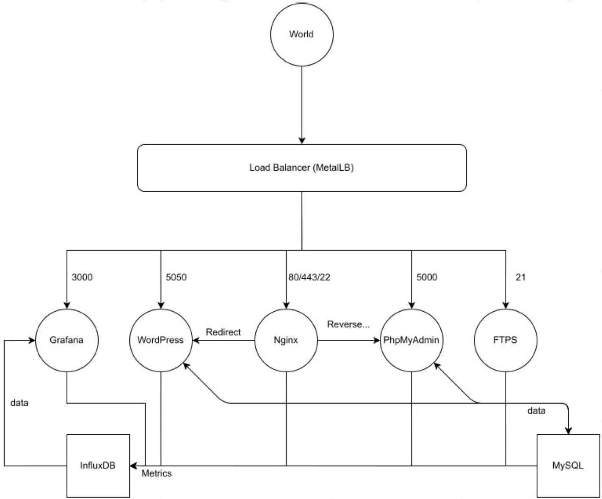

# ft_services

> Ft_services will introduce you to Kubernetes.
>
> You will discover cluster management and deployment with Kubernetes.
> 
> You will virtualize a network and do "clustering"

### Subject

> The project consists of setting up an infrastructure of different services. To do this, you must use Kubernetes. You will need to set up a multi-service cluster.
> Each service will have to run in a dedicated container.
> Each container must bear the same name as the service concerned and for performance reasons, containers have to be build using Alpine Linux.
> Also, they will need to have a Dockerfile written by you which is called in the setup.sh. You will have to build yourself the images that you will use. It is forbidden to take already build images or use services like DockerHub

### Services

- The Kubernetes web dashboard
- The Load Balancer
- A WordPress website listening on port 5050, which will work with a MySQL database
- phpMyAdmin, listening on port 5000 and linked with the MySQL database
- A container with an nginx server listening on ports 80 and 443. Port 80 will be in http and should be a systematic redirection of type 301 to 443, which will be in https
- A FTPS server listening on port 21
- A Grafana platform, listening on port 3000, linked with an InfluxDB database
- In case of a crash or stop of one of the two database containers, you will have to make sure the data persist
- All your containers must restart in case of a crash or stop of one of its component parts

### Scheme

  

